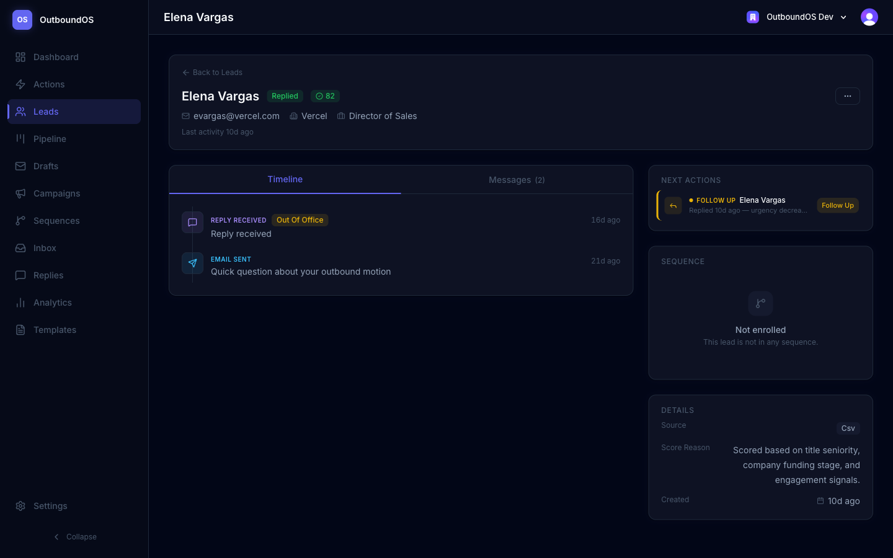
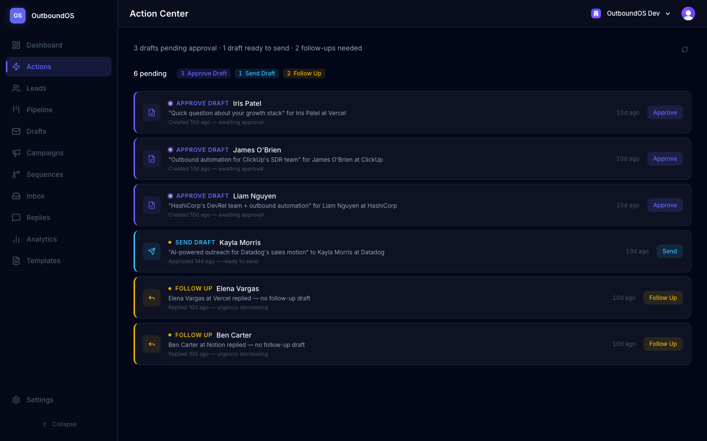
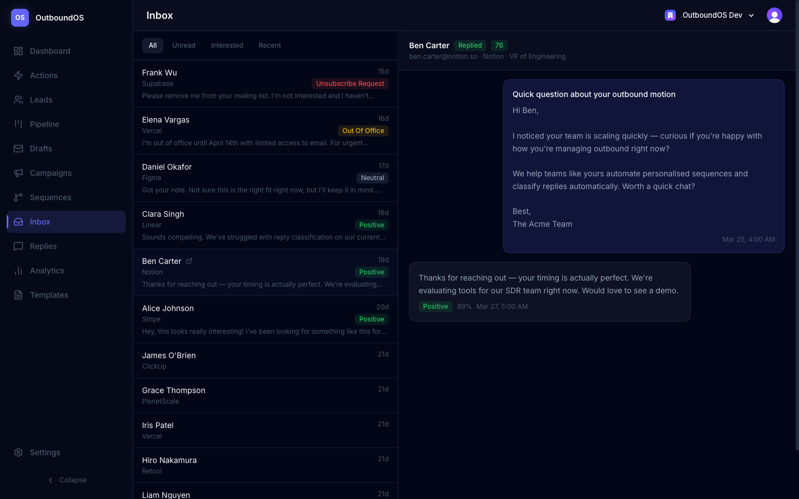
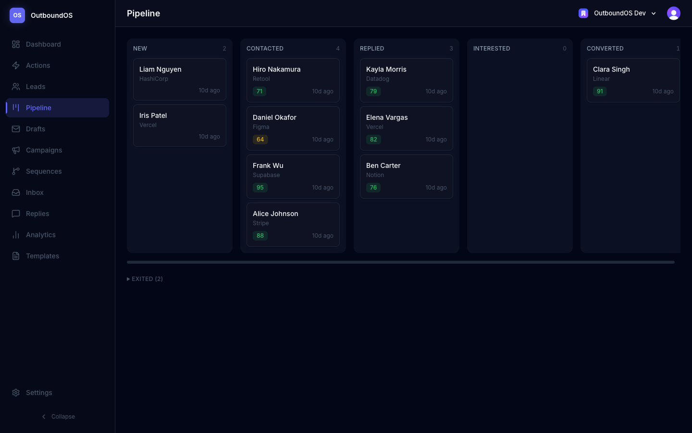

# OutboundOS

**Outbound sales automation that tells you what to do next — and lets you do it.**

Most outbound tools show you dashboards. OutboundOS shows you the next best action, explains why, and lets you execute it without leaving the page.

**[Live Demo](https://outboundos-site.vercel.app)**

---

## Screenshots

### Dashboard
KPI summary, activity charts, and a live Action Center that surfaces the highest-priority work.


### Lead Command Center
Everything about a single lead in one place — timeline, messages, next actions, sequence progress. Execute inline without navigating away.



### Action Center
Prioritized, reasoned actions across your entire pipeline. Each action explains *why* it matters and *how urgent* it is.



### Inbox
Threaded conversation view with reply classification and quick access to lead details.



### Pipeline
Drag-and-drop Kanban board showing every lead by status, with scores and last activity.



### Analytics
Funnel metrics, campaign performance, reply classification breakdown, and daily activity trends.


---

## What Makes This Different

### 1. Decision Engine (Action Center)
The system continuously scans your pipeline — pending drafts, unread replies, stale leads, interested prospects — and generates a prioritized action queue with reasoning and urgency indicators. It's not a notification list; it's a decision engine.

### 2. Execution Layer (Inline Actions)
Actions aren't just suggestions. From the Lead Command Center, you can approve drafts, send emails, and convert leads directly — with optimistic UI, ghost success states, and undo capability. The interface feels instant because it is.

### 3. Lead Command Center
A single-lead detail page inspired by Linear and HubSpot. Unified timeline (emails, replies, status changes, sequence steps), thread-style messages, sequence progress, and the filtered action queue for that specific lead.

---

## Core Features

**Lead Management**
- CSV import with validation
- AI-powered lead scoring (0-100) with reasoning
- Pipeline board with drag-and-drop status management
- Full status lifecycle with automatic transition rules

**Outbound Automation**
- AI draft generation with prompt versioning
- Human-in-the-loop approval workflow
- Multi-step email sequences with enrollment management
- SendGrid integration with daily send limits and event tracking

**Reply Intelligence**
- Automatic reply classification (Positive, Negative, Out of Office, Unsubscribe, Referral)
- Classification confidence scoring
- Automatic lead status transitions based on reply sentiment

**Decision Engine**
- Prioritized next-best-action queue
- Time-decay urgency messaging
- Per-lead action filtering
- Inline execution with optimistic UI and undo

**Analytics**
- Funnel conversion metrics (Sent → Delivered → Opened → Replied → Interested)
- Campaign performance comparison
- Reply classification breakdown
- Daily activity trends with date range controls

---

## Tech Stack

| Layer | Technology |
|-------|------------|
| Framework | Next.js 16 (App Router) |
| Language | TypeScript (strict) |
| Styling | Tailwind CSS v4 |
| Database | PostgreSQL (Neon) + Prisma v7 |
| Auth | Clerk (multi-tenant Organizations) |
| AI | OpenAI (gpt-4o) |
| Email | SendGrid |
| Testing | Vitest + React Testing Library |
| Deployment | Vercel |

---

## Architecture

```
src/
├── app/(dashboard)/       # Thin route pages (server components)
├── features/              # Feature modules
│   ├── leads/             # Lead management + Command Center
│   │   ├── server/        # Business logic (org-scoped queries)
│   │   └── components/    # UI components
│   ├── actions/           # Decision engine
│   ├── drafts/            # Draft generation + approval
│   ├── sequences/         # Multi-step sequences
│   ├── inbox/             # Threaded conversations
│   ├── analytics/         # Metrics + charts
│   └── dashboard/         # Dashboard modules
├── components/ui/         # Design system (Button, Badge, StatCard, etc.)
├── components/layout/     # Sidebar, Header, Navigation
└── lib/                   # Auth, DB, AI, Email utilities
```

**Key architectural decisions:**
- Business logic lives in `features/*/server/` — pages stay thin
- All queries are organization-scoped via `resolveOrganization()`
- Server-driven pages with client components for interactions
- Optimistic UI with server revalidation as source of truth

---

## Local Development

```bash
git clone https://github.com/justintud23/outboundos-site.git
cd outboundos-site
npm install
cp .env.example .env    # Fill in your keys
npx prisma migrate dev
npx prisma db seed      # Populate demo data
npm run dev
```

### Environment Variables

```env
DATABASE_URL=
CLERK_SECRET_KEY=
NEXT_PUBLIC_CLERK_PUBLISHABLE_KEY=
NEXT_PUBLIC_CLERK_SIGN_IN_URL=/sign-in
NEXT_PUBLIC_CLERK_SIGN_UP_URL=/sign-up
NEXT_PUBLIC_CLERK_AFTER_SIGN_IN_URL=/dashboard
NEXT_PUBLIC_CLERK_AFTER_SIGN_UP_URL=/dashboard
OPENAI_API_KEY=
OPENAI_MODEL=gpt-4o
SENDGRID_API_KEY=
SENDGRID_FROM_EMAIL=
NEXT_PUBLIC_APP_URL=http://localhost:3000
```

### Capture Screenshots

```bash
SCREENSHOT_EMAIL=you@example.com SCREENSHOT_PASSWORD=yourpass npx tsx scripts/capture-screenshots.ts
```

---

## Testing

```bash
npm test              # Run all 250+ tests
npm test -- --watch   # Watch mode
```

Tests cover server functions (business logic, edge cases, org isolation) and UI components (rendering, interactions, state management).
