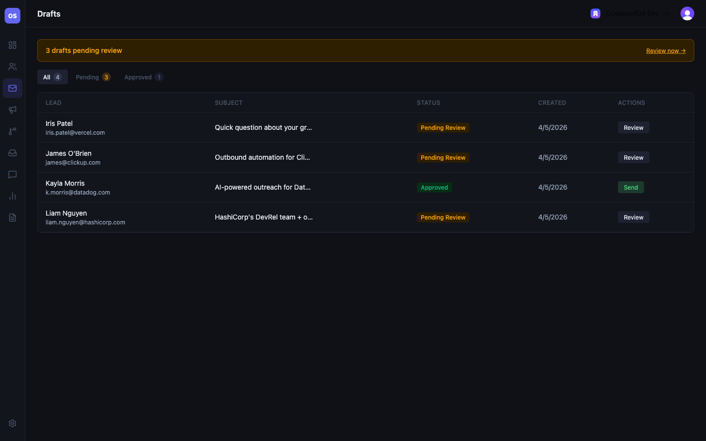

# OutboundOS

**Live Demo:** https://outboundos-site.vercel.app

**AI-powered outbound sales automation platform with reply intelligence, approval workflows, and analytics.**

---

## Overview

OutboundOS is a multi-tenant SaaS platform that automates outbound sales workflows while keeping humans in control of messaging quality.

```text
Leads → AI Scoring → Draft Generation → Approval → Send → Events → Replies → Intelligence
```

---

## Why I Built This

Built to solve real outbound sales problems:
- AI for speed and personalization
- Human approval for quality control
- Real engagement tracking
- Reply intelligence for automation

Also serves as a flagship full-stack portfolio project.

---

## Core Features

### Lead Ingestion
- CSV upload
- Org-scoped isolation

### AI Lead Scoring
- Structured scoring
- Provider abstraction

### AI Draft Generation
- Personalized emails
- Prompt versioning

### Approval Workflow
- Required before send
- Audit trail

### Email Sending
- SendGrid integration
- Daily caps
- Immutable records

### Webhook Tracking
- Idempotent ingestion
- Full payload storage

### Reply Intelligence
- Classification:
  - Positive
  - Negative
  - Out of Office
  - Unsubscribe
  - Referral
  - Unknown

### Replies Dashboard
- Filterable UI
- Classification highlighting

---

## Architecture

- Multi-tenant with Clerk Organizations
- Prisma/Postgres backend
- Feature-based structure
- AI abstraction layer
- Idempotent webhook system

---

## Tech Stack

| Layer | Technology |
|---|---|
| Framework | Next.js 16 (App Router) |
| Language | TypeScript |
| Styling | Tailwind CSS v4 |
| Database | PostgreSQL (Neon) + Prisma v7 |
| Auth | Clerk (Organizations) |
| AI | OpenAI (gpt-4o) |
| Email | SendGrid |
| Testing | Vitest + React Testing Library |
| Deployment | Vercel |

---

## Screenshots





---

## Local Development

```bash
npm install
npx prisma migrate dev
npm run dev
```

---

## Environment Variables

```env
DATABASE_URL=
CLERK_SECRET_KEY=
NEXT_PUBLIC_CLERK_PUBLISHABLE_KEY=
NEXT_PUBLIC_CLERK_SIGN_IN_URL=/sign-in
NEXT_PUBLIC_CLERK_SIGN_UP_URL=/sign-up
NEXT_PUBLIC_CLERK_AFTER_SIGN_IN_URL=/dashboard
NEXT_PUBLIC_CLERK_AFTER_SIGN_UP_URL=/dashboard
OPENAI_API_KEY=
OPENAI_MODEL=gpt-4o
SENDGRID_API_KEY=
SENDGRID_FROM_EMAIL=
NEXT_PUBLIC_APP_URL=http://localhost:3000
```

---

## Future Improvements

- Analytics expansion
- Campaign automation
- Inbox UI
- Queue system
