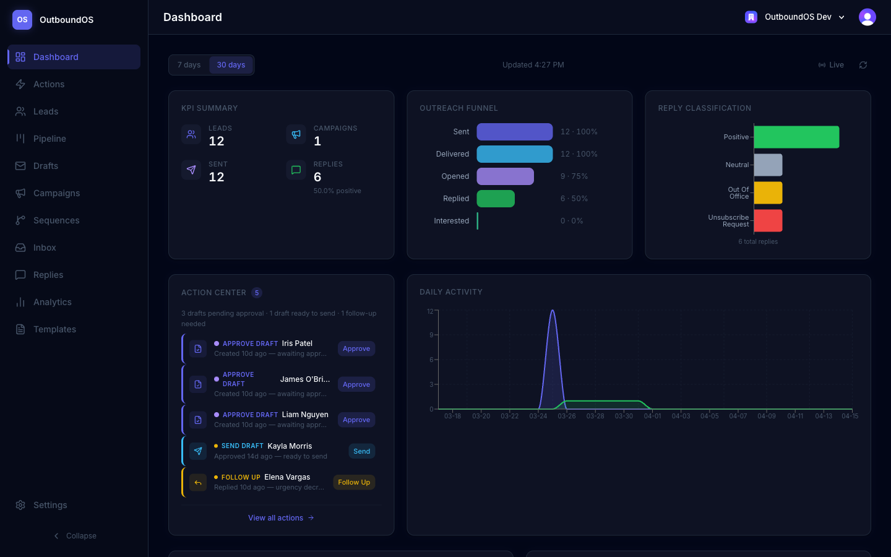
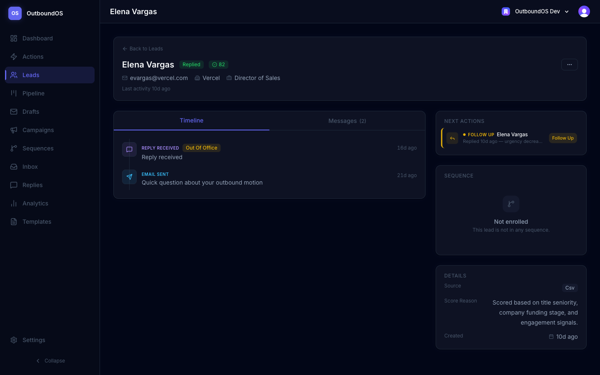
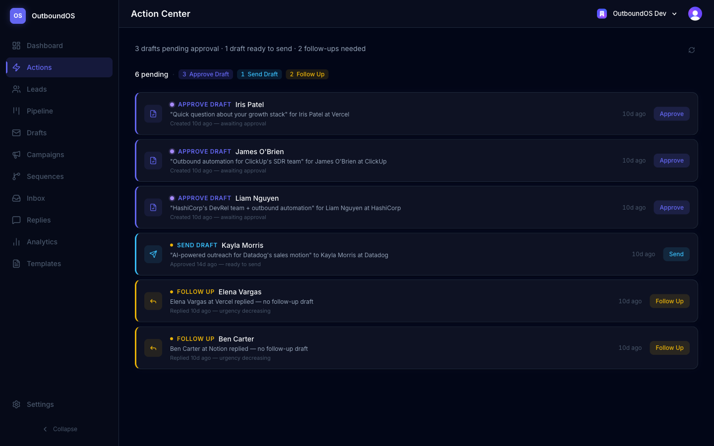
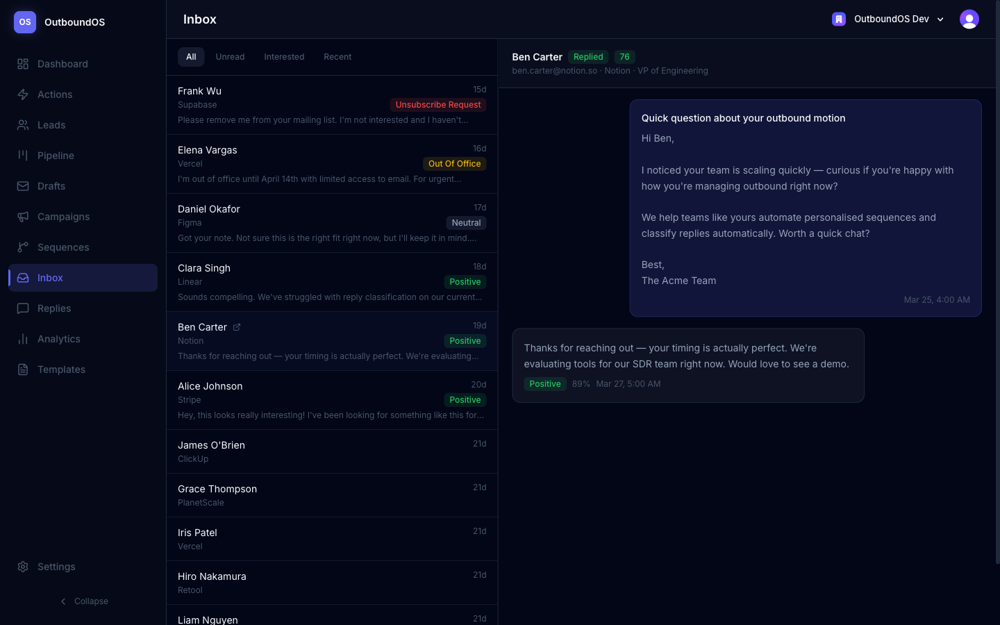
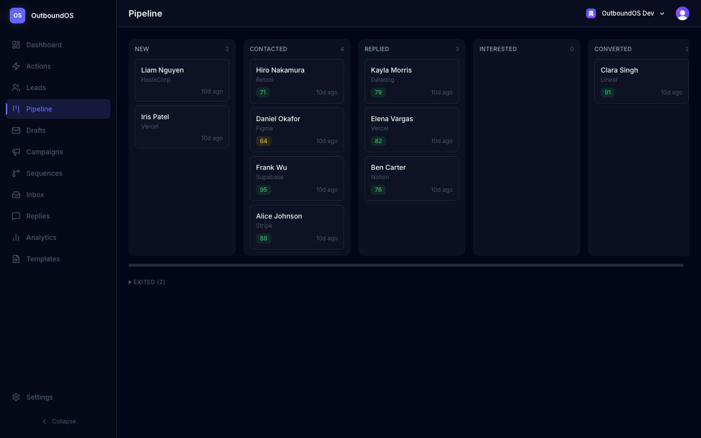
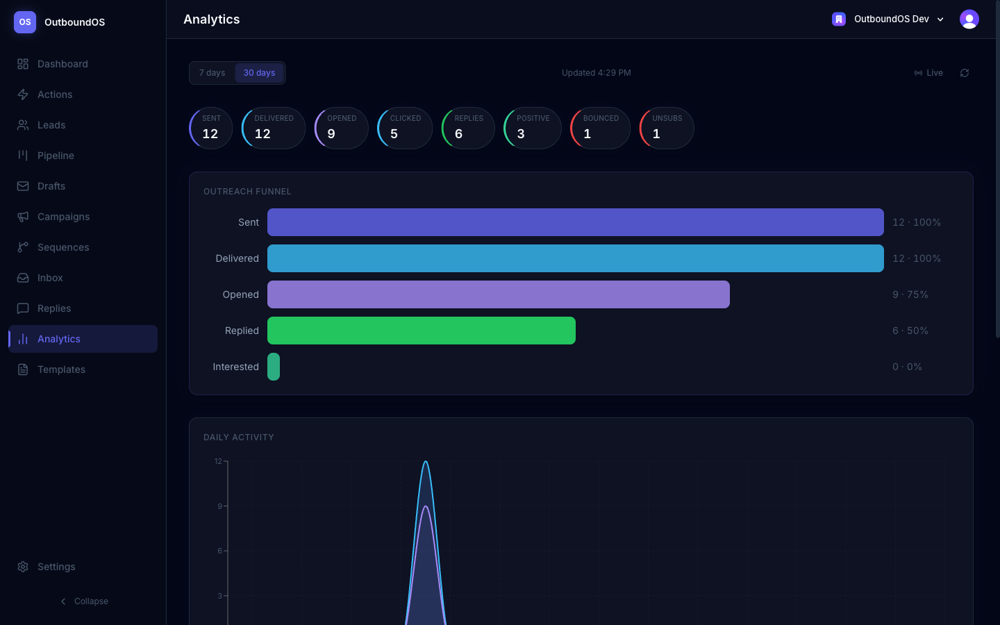

# OutboundOS

**Outbound sales automation that tells you what to do next — and lets you do it.**

Most outbound tools show you dashboards. OutboundOS shows you the next best action, explains why, and lets you execute it without leaving the page.

**[Live Demo](https://outboundos-site.vercel.app)**

---

## Screenshots

### Dashboard
KPI summary, activity charts, and a live Action Center that surfaces the highest-priority work.



### Lead Command Center
Everything about a single lead in one place — timeline, messages, next actions, sequence progress. Execute inline without navigating away.



### Action Center
Prioritized, reasoned actions across your entire pipeline. Each action explains *why* it matters and *how urgent* it is.



### Inbox
Threaded conversation view with reply classification and quick access to lead details.



### Pipeline
Drag-and-drop Kanban board showing every lead by status, with scores and last activity.



### Analytics
Funnel metrics, campaign performance, reply classification breakdown, and daily activity trends.



---

## What Makes This Different

### 1. Decision Engine (Action Center)
The system continuously scans your pipeline — pending drafts, unread replies, stale leads, interested prospects — and generates a prioritized action queue with reasoning and urgency indicators. It's not a notification list; it's a decision engine.

### 2. Execution Layer (Inline Actions)
Actions aren't just suggestions. From the Lead Command Center, you can approve drafts, send emails, and convert leads directly — with optimistic UI, ghost success states, and undo capability. The interface feels instant because it is.

### 3. Lead Command Center
A single-lead detail page inspired by Linear and HubSpot. Unified timeline (emails, replies, status changes, sequence steps), thread-style messages, sequence progress, and the filtered action queue for that specific lead.

---

## Core Features

**Lead Management**
- CSV import with validation
- AI-powered lead scoring (0-100) with reasoning
- Pipeline board with drag-and-drop status management
- Full status lifecycle with automatic transition rules

**Outbound Automation**
- AI draft generation with prompt versioning
- Human-in-the-loop approval workflow
- Multi-step email sequences with enrollment management
- SendGrid integration with daily send limits and event tracking

**Reply Intelligence**
- Automatic reply classification (Positive, Negative, Out of Office, Unsubscribe, Referral)
- Classification confidence scoring
- Automatic lead status transitions based on reply sentiment

**Decision Engine**
- Prioritized next-best-action queue
- Time-decay urgency messaging
- Per-lead action filtering
- Inline execution with optimistic UI and undo

**Analytics**
- Funnel conversion metrics (Sent → Delivered → Opened → Replied → Interested)
- Campaign performance comparison
- Reply classification breakdown
- Daily activity trends with date range controls

---

## Tech Stack

| Layer | Technology |
|-------|------------|
| Framework | Next.js 16 (App Router) |
| Language | TypeScript (strict) |
| Styling | Tailwind CSS v4 |
| Database | PostgreSQL (Neon) + Prisma v7 |
| Auth | Clerk (multi-tenant Organizations) |
| AI | OpenAI (gpt-4o) |
| Email | SendGrid |
| Testing | Vitest + React Testing Library |
| Deployment | Vercel |

---

## Architecture

```
src/
├── app/(dashboard)/       # Thin route pages (server components)
├── features/              # Feature modules
│   ├── leads/             # Lead management + Command Center
│   │   ├── server/        # Business logic (org-scoped queries)
│   │   └── components/    # UI components
│   ├── actions/           # Decision engine
│   ├── drafts/            # Draft generation + approval
│   ├── sequences/         # Multi-step sequences
│   ├── inbox/             # Threaded conversations
│   ├── analytics/         # Metrics + charts
│   └── dashboard/         # Dashboard modules
├── components/ui/         # Design system (Button, Badge, StatCard, etc.)
├── components/layout/     # Sidebar, Header, Navigation
└── lib/                   # Auth, DB, AI, Email utilities
```

**Key architectural decisions:**
- Business logic lives in `features/*/server/` — pages stay thin
- All queries are organization-scoped via `resolveOrganization()`
- Server-driven pages with client components for interactions
- Optimistic UI with server revalidation as source of truth

---

## Local Development

```bash
git clone https://github.com/justintud23/outboundos-site.git
cd outboundos-site
npm install
cp .env.example .env    # Fill in your keys
npx prisma migrate dev
npx prisma db seed      # Populate demo data
npm run dev
```

### Environment Variables

```env
DATABASE_URL=                        # pooled connection — app runtime
DIRECT_URL=                          # direct (non-pooled) connection — Prisma CLI migrations (Neon: non-pooler host)
CLERK_SECRET_KEY=
NEXT_PUBLIC_CLERK_PUBLISHABLE_KEY=
NEXT_PUBLIC_CLERK_SIGN_IN_URL=/sign-in
NEXT_PUBLIC_CLERK_SIGN_UP_URL=/sign-up
NEXT_PUBLIC_CLERK_AFTER_SIGN_IN_URL=/dashboard
NEXT_PUBLIC_CLERK_AFTER_SIGN_UP_URL=/dashboard
OPENAI_API_KEY=
OPENAI_MODEL=gpt-4o
SENDGRID_API_KEY=
SENDGRID_FROM_EMAIL=
SENDGRID_WEBHOOK_VERIFICATION_KEY=   # ECDSA public key from SendGrid; verifies signed event webhooks (unset = verification skipped, dev only)
UNSUBSCRIBE_TOKEN_SECRET=            # secret for signing one-click unsubscribe tokens (RFC 8058 List-Unsubscribe); any long random string
NEXT_PUBLIC_APP_URL=http://localhost:3000
```

### Capture Screenshots

```bash
SCREENSHOT_EMAIL=you@example.com SCREENSHOT_PASSWORD=yourpass npx tsx scripts/capture-screenshots.ts
```

---

## Testing

```bash
npm test              # Run all 250+ tests
npm test -- --watch   # Watch mode
```

Tests cover server functions (business logic, edge cases, org isolation) and UI components (rendering, interactions, state management).

---

## Microsoft 365 Sending Setup

Automated outbound email requires a dedicated Microsoft 365 tenant with sending mailboxes, application permissions, and an external scheduler.

### Operational Setup

1. **Buy domains:** 3 lookalike sending domains, e.g. `get<company>.com` and `<company>snow.com`. Point each domain's website at the main company site.
2. **Create the tenant:** a new Microsoft 365 tenant, with the domains added and verified.
3. **DNS:** SPF, DKIM (enabled in Defender), and DMARC (`p=none` to start) on every domain.
4. **Mailboxes:** 2–3 licensed mailboxes per domain, 7 total to start, with realistic names. Outlook signatures are **not** applied to mail sent through Microsoft Graph — put the signature in your sequence templates instead.
5. **Grant access:** give the user Full Access and Send As on every sending mailbox so they auto-map in Outlook. Then, in **Exchange Online PowerShell**, make every sending mailbox keep a copy of what is sent as/on behalf of it — OutboundOS detects that you've already handled a reply by looking for your answer in the sending mailbox's Sent Items:
   ```powershell
   Set-Mailbox <mailbox> -MessageCopyForSentAsEnabled $true -MessageCopyForSendOnBehalfEnabled $true
   ```
   Run it once for each sending mailbox.
6. **Notifications mailbox:** create the shared mailbox for notifications.
7. **App registration:** 
   - Register an app in **Entra ID > App registrations**.
   - Redirect URI: `https://<app>/api/integrations/microsoft/callback` (Web).
   - Grant application permissions: `Mail.Send`, `Mail.ReadWrite`, `User.Read.All`.
   - Click **Grant admin consent** to approve these permissions for the entire tenant.
   - Copy the **Directory (tenant) ID** from the app's Overview page into `MS_GRAPH_TENANT_ID`. OutboundOS only accepts a Microsoft 365 connection from this tenant; connecting is refused while it is unset.
   - Create a mail-enabled security group "Sending Mailboxes" containing all sending mailboxes and the alerts shared mailbox.
   - In **Exchange Online PowerShell**, run:
     ```powershell
     New-ApplicationAccessPolicy -AppId <MS_GRAPH_CLIENT_ID> -PolicyScopeGroupId sending-mailboxes@<domain> -AccessRight RestrictAccess -Description "OutboundOS"
     ```
   - Verify it with:
     ```powershell
     Test-ApplicationAccessPolicy -Identity mike@<domain> -AppId <MS_GRAPH_CLIENT_ID>
     ```
8. **Scheduler:** Set up three **cron-job.org** jobs, each running every 5 minutes with method `GET` and header `Authorization: Bearer <CRON_SECRET>`:
   - `https://<app>/api/cron/sequence-runner`
   - `https://<app>/api/cron/send-queue`
   - `https://<app>/api/cron/inbox-monitor`
   
   Enable **"notify on failure"** on all three jobs. The send-queue and inbox-monitor jobs deliberately return HTTP 503 when Microsoft 365 rejects OutboundOS (expired client secret, revoked consent — sending is paused) or mailboxes fail to poll, because the in-app alert email can't get out through the same broken credentials; cron-job.org's failure email is the alert. cron-job.org auto-disables a job after repeated failures: once you've fixed the cause (and resumed sending in Settings), re-enable any job it disabled.
9. **Warmup:** Plan 2–4 weeks before full volume. The app's warmup ramp starts low automatically. A peer-warmup service is recommended during this period.

### In-App Setup

Once infrastructure is in place:

1. **Settings → Connect Microsoft 365** — click the admin consent link to authorize the app for your tenant.
2. **Load mailboxes** — the app lists available mailboxes; import the sending ones.
3. **Configure defaults:**
   - Set escalation email (where replies are forwarded).
   - **Set business name and mailing address — required.** CAN-SPAM requires a physical postal address (a USPS-registered PO box is fine) in every commercial email; the app adds it to every email's footer and **blocks all sending until it is set**.
   - Set timezone and business hours (default 08:00–17:00, Mon–Fri).
   - Leave **Allow Canadian recipients** off. Canada's anti-spam law (CASL) requires consent even for B2B email, so leads that look Canadian (country/province column, `.ca` email, or Canadian phone area code) are never enrolled or emailed and are labelled *Excluded: Canada (CASL)* on the Leads page. Turn it on only if you have documented consent.
4. **Create a campaign** and add a multi-step sequence.
5. **Enroll leads** from your CSV. Extra columns (city, state, country, lot count, …) are kept on each lead and usable as `{city}`-style merge fields.
6. **Turn on auto-send** for the campaign. The app generates a sample batch of 10 drafts.
7. **Approve the sample** — review personalization and guardrail flags. Once approved, the sequence runs automatically.

### Writing Templates

**Merge fields:**
Use `{fieldName}` for lead attributes. If a field is missing, provide a fallback:
```
{company|your company}
```

**Personalization marker:**
Include `{personalization}` where the AI will insert 1–2 sentences tailored to the lead:
```
Hi {firstName|friend},

{personalization}

Would you be interested in learning more?
```

**Guardrails:**
The system blocks sends containing:
- Currency amounts (`$` followed by digits)
- The words "guarantee", "guaranteed", or "free"
- Any org-configured blocked phrase

**Exemptions:**
- Words listed under **Always-allowed words** (Settings) bypass the rule.
- Any phrase that appears verbatim in your approved template is exempt.

---

## Business profile & lead scoring

**Set Up**

Go to Settings → Business profile, select a preset like "Commercial snow & paving" (or start blank), and add 1–5 of your service yards by ZIP code and radius (1–200 miles). Save your profile, then click **Rescore all leads** to recalculate existing leads.

**How Scores Work**

Leads score 0–100 based on location, property type, size, title keywords, and relationship history:

| Factor | Points |
|--------|--------|
| In-area ZIP or always-include list | +30 |
| Within 1.25× radius | +15 |
| Unknown or no ZIP | +10 |
| Outside area or never-include list | **cap 15** |
| Property type (great) | +25 |
| Property type (good) | +15 |
| Property type (unknown/unmatched) | +8 |
| Property type (no-go) | **cap 10** |
| Big size (≥ threshold sites or acres) | +15 |
| Some size present | +5 |
| Down-rank keyword in title | −10 |
| Decision keyword | +15 |
| Other title | +5 |
| Past customer | +15 |
| Lost quote | +10 |

The rules score is capped when a lead is out of area (15) or a not-a-fit property type (10). Any capped lead skips AI adjustment. AI refines by ±15 (final score clamped to 0–100) using fit reasoning. See the breakdown under "How this score was calculated" on each lead's page.

**CSV Import**

Include these columns (or map in Settings → Business profile → Column mapping):

- **ZIP/address:** `zip`, `zip_code`, `zipcode`, `postal_code`, `postcode`, or a ZIP within `address`, `property_address`, `street_address`
- **City:** `city`, `property_city`, `town`
- **Property type:** `property_type`, `type`, `segment`, `account_type`, `industry`
- **Size:** `sites`, `number_of_sites`, `locations`, `properties`, `property_count`, `num_properties`, `acres`, `lot_size`, `lot_acres`
- **Relationship:** `relationship`, `status`, `customer_status`, `lead_type` — use "customer"/"client" for past customers, "lost"/"quote"/"quoted" for lost quotes

Use Settings → Business profile → **Column mapping** for any other columns.

**Merge Fields**

Personalize sequences with lead data; always include a fallback:

```
{propertyType|your property}
{city|your market}
{sites|your locations}
```

**Starter Sequences**

Once your profile is saved, Sequences → New shows a **Start from template** option with three preset templates. Edit the wording and add your name under "Thanks," before enrolling leads.

**No Business Profile**

Organizations without a business profile use the original generic AI scoring (based on title, company and email domain). The sequence form shows no templates. Merge fields like {propertyType}, {city}, and {sites} fall back only if the lead has no such column.

---

## Team & rep ownership

**Roles & Visibility**

Reps appear in Settings → Team after they sign in once. Admin or member status comes from your Clerk organization role (Clerk "Admin" → admin here). Members can access Settings → My settings (to set their escalation email and sender names) and see the Team list read-only; sending, business profile, mailboxes, deliverability, templates, and team-wide options show as read-only or "Ask an admin…" for members. Connecting Microsoft 365 (Settings → Connect Microsoft 365) is admin-only. Members do see the Salesforce status card in Settings (connection status and recent sync counts, read-only); connecting, disconnecting, changing Salesforce settings, and retrying failed jobs are admin-only.

All team members can view every campaign, lead, sequence, and reply, but reps can only change work they own. Unassigned items and admin-only settings are restricted to admins.

**Ownership Model**

- **Campaigns** are owned by whoever creates them. Reassigning a campaign (Campaign page, admin only) doesn't move sequences already in progress — they keep their original mailbox.
- **Leads** are automatically owned by their campaign owner when first enrolled (never overwriting an existing owner). Admins can reassign leads (Lead page).
- **Mailboxes** are assigned by an admin via the **Owner** dropdown in Settings (mailbox list). Unassigned mailboxes are shared across the team.

Admins see a banner until every campaign and mailbox has an owner (dismissible).

**Sending as a Rep**

When a rep owns a campaign:
- Emails send from that rep's own mailboxes. If the rep owns none, emails use shared (unassigned) mailboxes.
- If the rep's mailboxes are all paused or on failing domains, the email waits in queue — never falls back to shared or another rep's mailbox.
- Manual send (Drafts page) applies the same rules, keyed on the draft's campaign owner (or the lead owner when the draft has no campaign).

**Sender Fields & Templates**

Merge fields `{senderFirstName}` and `{senderName}` (first + last, trimmed) pull from the campaign owner's sender name (Settings → My settings). Custom fields with these names always win.

Starter templates automatically sign off with `Thanks,\n{senderFirstName|}` on each step.

**Reply Alerts**

Reply emails are sent to:
1. The lead owner's escalation email (Settings → My settings; defaults to their login email)
2. Falls back to the mailbox owner's escalation email
3. Falls back to the organization's escalation email

Additionally, if **Copy admin on reps' replies** is on (Settings → Team, on by default), the organization escalation email is CC'd. System alerts (domain health, verification, scheduler) always go to the organization escalation email only.

**Views & Preferences**

Use the **Mine / Team toggle** on Leads, Pipeline, Campaigns, Sequences, Drafts, Inbox, Replies, and Dashboard to switch between your work and the full team view. Your last choice is remembered. Reps default to Mine; admins default to Team.

---

## Salesforce

OutboundOS can connect to a Salesforce org to check leads against Salesforce before sending, import leads and contacts from Salesforce list views, and log sent emails and replies back to Salesforce as activity.

### Setup, once per deployment

1. In a Salesforce org you control, go to Setup → External Client App Manager → New.
2. Enable OAuth and add the scopes `api`, `refresh_token`, and `id`.
3. Set the callback URL to `https://<your-app>/api/integrations/salesforce/callback`.
4. Require PKCE.
5. Set `SALESFORCE_CLIENT_ID` and `SALESFORCE_CLIENT_SECRET` in Vercel.
6. Generate `TOKEN_ENCRYPTION_KEY` with `openssl rand -base64 32` and set it in Vercel (it also encrypts stored Salesforce refresh tokens).

If any of these are missing, the Salesforce card in Settings just says "Salesforce isn't configured on this server," and nothing else changes.

### Connecting

- An admin connects from Settings → Salesforce → Connect Salesforce, choosing Production or Sandbox.
- Connect with a Salesforce user that has API access, ideally a dedicated integration user rather than a real rep's login.
- Ask your Salesforce admin two things first: which edition you're on (Enterprise and Unlimited include API access; Professional may need the API add-on), and to approve the OutboundOS connected app when prompted.
- The OAuth flow uses PKCE. The code verifier is held in a cookie scoped to the callback path (`/api/integrations/salesforce/callback`) only.
- Reconnecting to a different Salesforce org than the one already connected clears every lead's existing Salesforce link (id, type, account, and check status), so nothing keeps pointing at the old org's records.

### Importing

- From the Leads page, any member can open Import from Salesforce, pick Leads or Contacts and a Salesforce list view, and preview the first rows before importing.
- Up to 2,000 records import per run. If the list view has more, the dialog warns that only the first 2,000 will be imported.
- Records are skipped and counted separately by reason: customer, open opportunity, opted out, converted lead, no email, or invalid email.
- Re-running the same import only adds leads that don't already exist. Existing leads matched by email are updated and linked instead of duplicated.
- Admins get an extra option, "Use Salesforce owners where they match a rep," which assigns each imported lead to the team member whose email matches the Salesforce record's owner. Otherwise, and always for members, the importing user becomes the owner.
- Importing is refused with a clear message while Salesforce isn't connected, needs reconnecting, or is paused for the day under the API limit below.

### Activity logging

- Once a lead is linked to Salesforce, every send and every reply is logged as a completed Salesforce Task (subject, body, activity date, and owner when it can be resolved). Turn this off per org with the "Log emails and replies to Salesforce" setting.
- A reply from a lead that isn't linked to Salesforce yet creates a new Salesforce Lead first (matching an existing Contact or Lead by email when one exists), then logs the reply against it.
- Failed logging jobs retry automatically: 5 minutes, 30 minutes, 2 hours, 12 hours, then 12 hours again, and are marked failed after 6 attempts.
- Failed jobs show up in Settings → Salesforce with a Retry button, visible to admins.
- If the Salesforce record a lead is linked to gets deleted, the next reply from that lead recreates the Salesforce Lead and re-logs its send and reply history against the new record.

### Pre-send check

Before OutboundOS emails a lead in a connected org, it checks Salesforce and holds or blocks the send based on the org's rules: opted out, a converted lead, a customer (by the account types configured in Settings → Salesforce), or, optionally, an open opportunity.

- A check is cached for 24 hours. A cached check that recent decides the send without a new Salesforce call.
- If Salesforce can't be reached, a cached check less than 7 days old is still used to decide.
- Otherwise the send is held, not blocked, and retried about every 10 minutes until Salesforce answers or a still-usable cached check exists.
- If sends stay held for more than 24 hours, admins get one alert email a day until checks start succeeding again.
- The same hold-and-retry behavior applies while the connection needs reconnecting, not only when a single lookup fails.
- An admin can clear a block from the lead page with "Allow anyway." This doesn't restart a sequence that already stopped because of the block; the lead has to be re-enrolled to keep sending.

### Limits

- Every Salesforce request times out after 10 seconds.
- Salesforce work (checks, imports, activity logging) pauses once the org has used 80% of its daily Salesforce API limit, and resumes automatically after midnight UTC.

---

## Deliverability

The **Deliverability** page (available only when Microsoft 365 is connected) monitors domain health, enforces sending ramps, and protects your reputation through automated checks and alerts.

### Ramp Presets

Email warming is built in. Every mailbox starts with a conservative ramp that gradually increases daily send volume over 29 days. Change the preset per mailbox on the Deliverability page (changing it keeps the current ramp day); **Restart ramp** there sends a mailbox back to day 1:

| Ramp Day | Conservative | Standard | Aggressive |
|----------|--------------|----------|-----------|
| 1–3 | 3/day | 5/day | 10/day |
| 4–7 | 5/day | 10/day | 18/day |
| 8–14 | 10/day | 18/day | 25/day |
| 15–21 | 18/day | 25/day | full |
| 22–28 | 25/day | full | full |
| 29+ | full | full | full |

"Full" means the mailbox's daily limit. Turning off the ramp gives you the full limit immediately, but young domains (registered < 30 days ago) are still capped at 10/day until they age.

### Domain Health Checks

Outbound mail is queued until your domains pass verification. Checks run on import, daily (at 16:00 UTC), and on demand via **Recheck now** (limited to once per 60 seconds per domain). A domain fails if **any** check fails; queued mail waits and is never lost.

**SPF:** Must include `spf.protection.outlook.com` and end with `-all` (reject) or `~all` (softfail).

**DKIM:** Both Microsoft 365 CNAME records must exist in DNS, and DKIM must be enabled in **Microsoft Defender → Email authentication → DKIM**.

**MX:** Must resolve to `*.mail.protection.outlook.com`.

**DMARC:** Recommended but only warns; a missing or failing DMARC record does not block sending.

**Young domain rule:** Domains registered less than 30 days ago (or with unknown registration dates from the registry) are capped at 10 sends per day regardless of the mailbox ramp. Update the registration date on the page if RDAP doesn't find it.

### Alerts

You receive one email when a domain **starts failing** checks and one email when it **recovers**. Alerts are sent from `MS_NOTIFY_MAILBOX` to the organization's escalation email.

### Email Verification

MillionVerifier validates each lead's email address when they're enrolled, catching invalid and risky addresses before they enter your sequence.

- **Setup:** Set `MILLIONVERIFIER_API_KEY` in Vercel (Production, and Preview if wanted). Without it, verification is off and sending works as before. Imports cost nothing.
- **Turning it on:** drafts already waiting for review or in an unapproved sample batch when you first set the key are not re-checked — approve or reject them before adding the key.
- **Results per address:**
  - **Verified** → sends normally.
  - **Risky** (catch-all or unknown) → sends unless **Block risky emails** is on in Settings.
  - **Invalid** or **disposable** → enrollment is stopped.
  - Real bounces also mark an address Invalid.
- **Timing:** Checks run every 5 minutes inside the sequence runner. Results are cached for 90 days. The first email waits for verification to complete; manual **Send** returns "This lead's email address is being verified. Try again in a few minutes."
- **Alerts:** If credits run out or the key is rejected, first emails wait. You get one alert email, and the Deliverability page shows "Verification paused".

### Content Check

Every email step and subject variant gets a **Low / Medium / High** risk score, shown live in the sequence editor and campaign page.

- **High-risk rules:** fake `Re:`/`Fwd:` on the first email, link shorteners, 3+ links in a single message, or blocked words and price amounts.
- **Auto-send gate:** Campaigns with **High** content cannot enable auto-send (and live campaigns cannot be edited to High) until the content is fixed or a team member records an override reason (10–500 characters) on the campaign page.
- **Override behavior:** An override stops applying when the email content changes, requiring re-approval.
- **Personalization:** AI-inserted personalization lines (`{personalization}`) are still governed by per-email guardrails.

### Placement tests and blocklist alerts

The **Placement test** card on a campaign's page (once Microsoft 365 is connected) sends the campaign's real first email, from a mailbox you choose, to seed addresses from a free placement tester — [unspam.email](https://unspam.email) or [EmailConsul](https://www.emailconsul.com) both work. Paste the seed addresses the tester gives you, pick a sequence, mailbox, and optionally a real enrolled lead (or use the built-in sample), and send. Read the inbox-placement results on the tester's own site — OutboundOS doesn't store or poll them.

- Test sends count toward that mailbox's daily limit, exactly like a real send, so they respect warmup ramps and domain health.
- Run a test before each new campaign goes live, and weekly while a domain is still ramping.
- No results, no draft, and no lead record is created by a placement test — only an audit log entry (without the seed addresses).

**Blocklist alerts (free):** add each sending domain to [HetrixTools' free Blacklist Monitor](https://hetrixtools.com/blacklist-monitor/) (up to 32 monitors on the free plan) with email alerts sent to your escalation address. Microsoft 365 sends from shared IPs, so monitor your **domains**, not IP addresses.

### What We Don't Do

OutboundOS does not automate opens, replies, or spam rescue — that violates Google's and Microsoft's terms. Warmup here means careful real sending: a slow volume ramp on correctly authenticated domains, with bounce and complaint monitoring.
